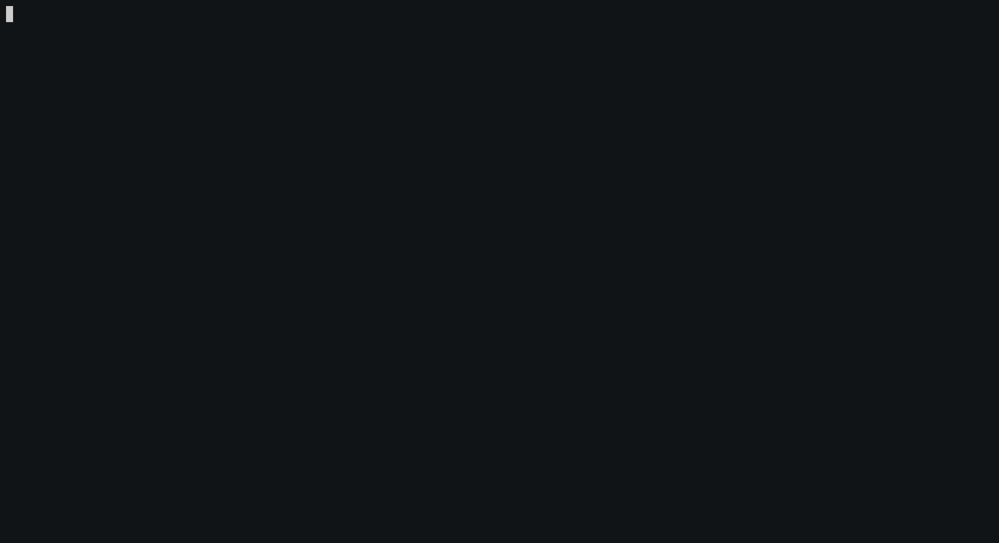
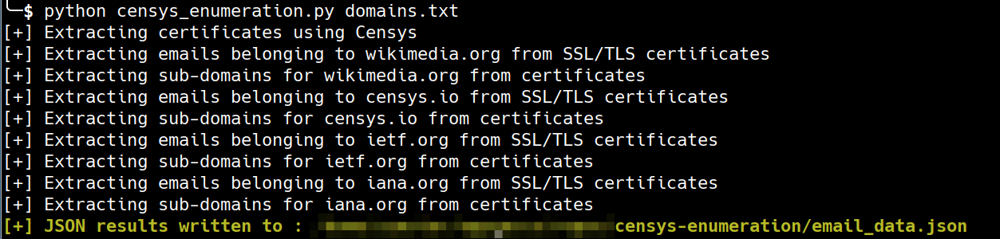
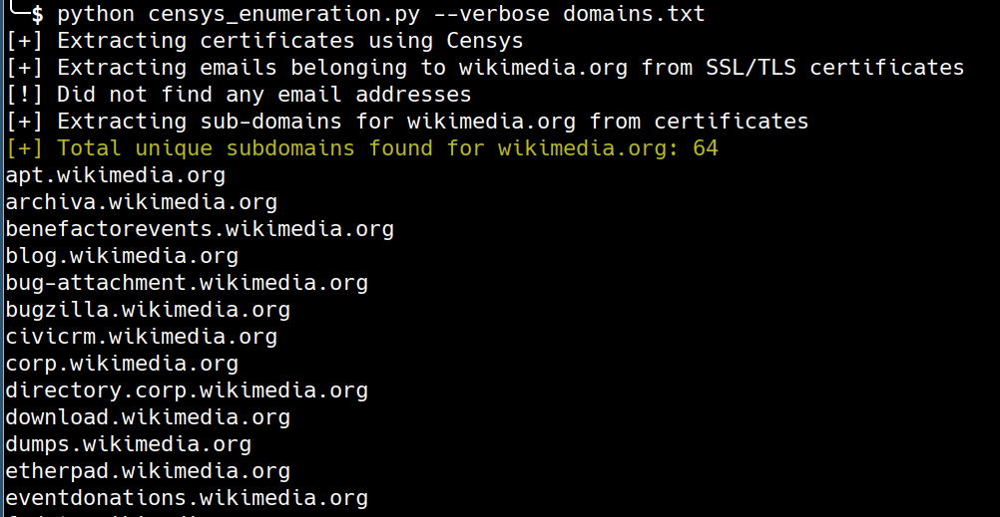
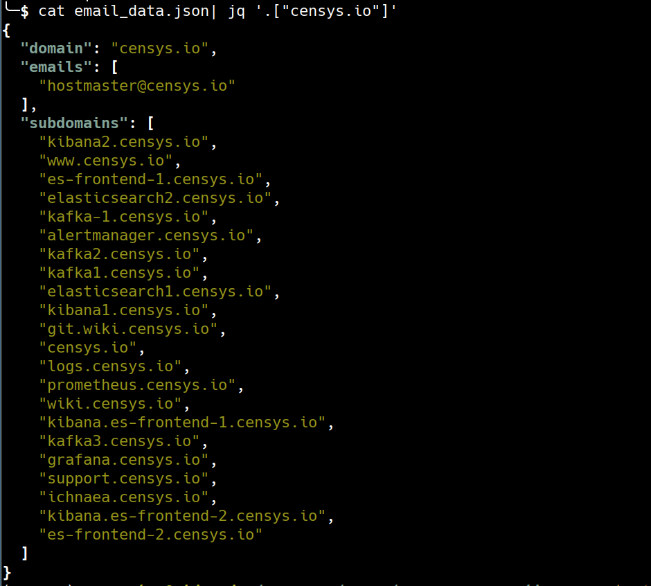

# Censys Enumeration

- A script to extract subdomains/emails for a given domain using SSL/TLS certificates dataset on Censys
- The output is in JSON format

## Demo


## Screenshots

#### Non verbose mode



#### Verbose mode


#### Sample JSON output

## 3rd party package dependency 

[**censys**](https://pypi.python.org/pypi/censys)

[**click**](https://pypi.python.org/pypi/click)

## Setup

- Clone this repo

```bash
$ git clone git@github.com:yamakira/censys-enumeration.git
```

- Install dependencies

```bash
$ pip install -r requirements.txt
```

- Get Censys API ID and Censys API secret by creating a account on `https://censys.io`

- Add Censys API ID and Censys API secret as  `CENSYS_API_ID` & `CENSYS_API_SECRET` respectively to the OS environment variables. On Linux you can use a command similar to following to do this

```bash
$ export CENSYS_API_SECRET="iySd1n0l2JLnHTMisbFHzxClFuE0"
```

- Check help menu


```bash
$ python censys_enumeration.py --help                                                                                                 
Usage: censys_enumeration.py [OPTIONS] FILE

Options:
  --verbose                       Verbose output
  --subdomains / --no-subdomains  Enable/Disable subdomain enumeration
  --emails / --no-emails          Enable/Disable email enumeration
  --help                          Show this message and exit.
```

## Usage

- Subdomain and email enumeration

```
$ python censys_enumeration.py domains.txt
```

- Only subdomain enumeration

```
$ python censys_enumeration.py --no-emails domains.txt 
```

- Only email enumeration

```
$ python censys_enumeration.py --no-sudomains domains.txt 
```

- Verbose output

```
$ python censys_enumeration.py --verbose domains.txt 
```

- Output to custom file

$ python censys_enumeration.py --verbose --outfile results.json domains.txt 
```
```