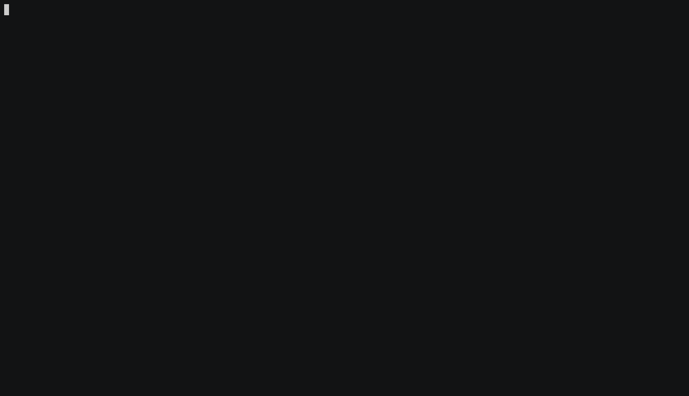

# domains-from-csp

A Python script to parse domain names from CSP header

- A script to extract domain names from Content Security Policy(CSP) headers
- The output is print to stdout for now

## Demo



## Screenshots


## 3rd party package dependency 

[**requests**](https://docs.python-requests.org)

[**click**](https://pypi.python.org/pypi/click)

## Setup

- Clone this repo

```bash
$ git clone git@github.com:yamakira/censys-enumeration.git
```

- Install dependencies

```bash
$ pipenv install
```


- Check help menu


```bash
$ python csp_parser.py --help
                                                                                                   2 ↵
Usage: csp_parser.py [OPTIONS] URL

Options:
  -r, --resolve / --no-resolve  Enable/Disable DNS resolution
  --help                        Show this message and exit.

```

## Usage

- Parse the CSP header for domain names but don't do DNS resolution


```
$ python csp_parser.py target_url
```

- Parse the CSP header for domain names and also do DNS resolution

```
$ python csp_parser.py target_url --resolve
```

```
$ python csp_parser.py target_url -r
```